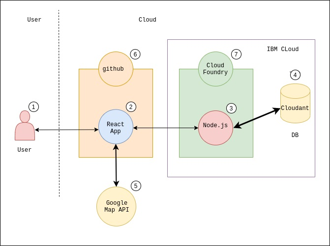
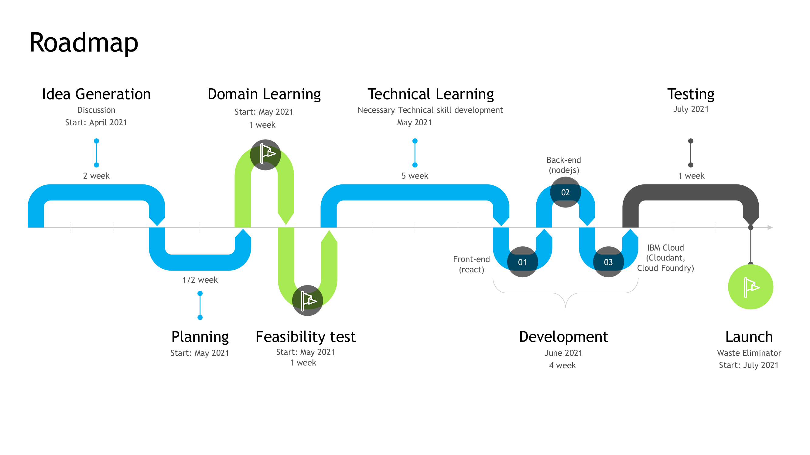

# Waste Eliminator

Waste Eliminator is simple web application where anyone can make an alert of uncontrolled waste by uploading image and location.

## Contents

- [Waste Eliminator](#waste-eliminator)
  - [Contents](#contents)
  - [Short description](#short-description)
    - [What is Waste Eliminator?](#what-is-waste-eliminator)
    - [How Waste Eliminator works?](#how-waste-eliminator-works)
  - [Video Pitch](#video-pitch)
  - [The architecture](#the-architecture)
  - [Long description](#long-description)
  - [Project roadmap](#project-roadmap)
  - [Project Code](#project-code)
  - [Built with](#built-with)
  - [Contributing](#contributing)
  - [Authors](#authors)

## Short description

### What is Waste Eliminator?

Waste Eliminator is simple web application where anyone can make an alert of uncontrolled waste by uploading image and location

### How Waste Eliminator works?

Waste Eliminator adds a marker on the map when an user posts an alert. According these data uploaded by users, Waste Eliminator will create clusters on the map based on density of alert in a certain area.

## Video Pitch
[Watch the video](https://www.youtube.com/watch?v=DKYzY-z72T0)

## The architecture

1. The user navigates to the react apps and uploads a photo and sends location.
2. The react app establish connection with the back-end and google map api.
3. The back-end is a node.js api which is connected to the cloudant.
4. All the information is stored in cloudant which is the database of our project.
5. The google map api is used to show the stored location of the database.
6. The react app is hosted in the github.
7. The back-end api is hosted in cloud foundry.

## Long description

[More detail is available here](./description.md)

## Project roadmap

The project roadmap is shown below -

## Project Code

The front-end and back-end code is given below

- [Waste Eliminator](./)
- [back-end-api](./backend/)

## Built with

- [IBM Cloudant](https://cloud.ibm.com/catalog?search=cloudant#search_results) - The NoSQL database used
- [IBM Cloud Foundry](https://cloud.ibm.com/catalog?search=Cloud%20Foundry#search_results) - For hosting the backend API
- [Google Map API](https://developers.google.com/maps/gmp-get-started) - For mapping the location
- [GitHub](https://github.com) - For hosting the client site

## Contributing

Please read [CONTRIBUTING.md](CONTRIBUTING.md) for details on our code of conduct, and the process for submitting pull requests to us.

## Authors
1. [Md. Abdullah Al Mamun](https://github.com/mamuncseru)
2. [Md. Al Shahria](https://github.com/ShahriarRu)
3. [Md. Meem Mursalin Chowdhury](https://github.com/mursalin117)

